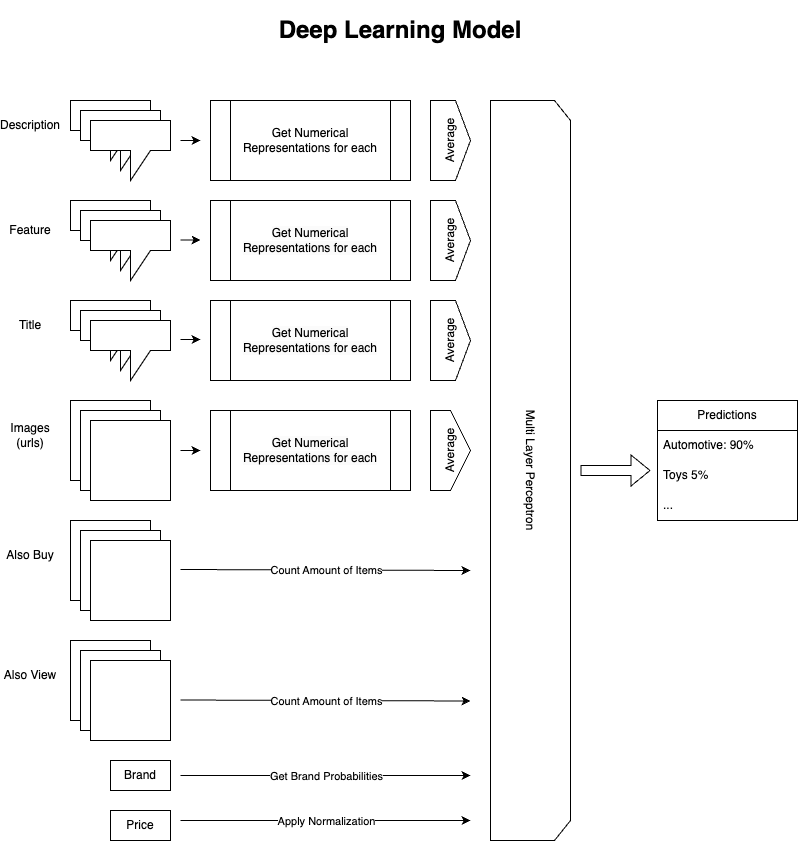

## Solution

The project structure is the following:

```
├── README.md
├── SOLUTION.md
├── api                 # API endpoint
├── notebooks           # Notebooks for analysis of the data
├── requirements.txt    # Common dependencies between api & notebook
├── shared              # Shared functionalities between api & notebooks
└── tests               # Testing of all functionalities
```

**MODEL PROPOSED**

The proposed model has the the following parts:

#### 1. Brand 1-2-1 Relationships

A matrix that specifies the proportion of sold products to each main industry for a given brand. If a brand has 95% of their products in the Automotive industry, we can infer that category directly.

#### 2. Deep Leaning Model

Consists of the following features:

- **Text Embeddings**: for descriptions, features and titles (with avg pooling layer if multiple)
- **Image Embeddings**: image representations (with avg pooling layer if multiple images)
- **Brand encoding** (with main brands and others)
- **Price**
- **Recommended products** to view and buy (count)

A numerical vector is then passed through an MLP for classification.

The representation of this model:


**MODEL LIMITATIONS**

1. Brand 1-2-1 Limitations

Those relationships have the following limitations:

- Brands that have a lot of observations may not have a clear 1-2-1 relationship between brand and industry, as they may not rely on only one industry.
- Proportions cannot be predicted specifically for all brands, especially new brands or those with few observations (so it was grouped in 'Other' name).

2. Deep Learning Model Limitations

This model has the following limitations:

- **Black box**; you do not know the why of a certain prediction. This lack of interpretability puts a lot of limitations on creating new approaches to improve the model.
- **Model size**; this model has a lot of parameters and features, so it will not fit in small-sized machines. And can be hard to scale it up
  - One solution to this would be to divide it in different services, where you could get the features from different APIs.
- **Fine-tuned**; for now the training is only on the MLP. This means that the weights of the model for extraction of text and image are not fine-tuned, which could make those representations to not be the most suitable for this type of problem.
- **Over-reliance textual and visual data**: the vast majority of the values in the numerical vector that is passed though the MLP are from text and visual data. There might be redundancy between those embeddings (in the sense that can contain noise and repeated information).
- **Overfitting**: having used all the features in the dataset can lead the neural network to be finding specific patterns that would make it to do not generalise well.
- **Recommendations**: the model is only counting the number of products recommended to buy and view. Could be interesting to have more information about those recommended products, to take advantage for example of degree of complementarity of the products between industries.

**WHAT WOULD YOU CHANGE IF YOU WANTED TO PREDICT ALL CATEGORIES**

In the list of categories, we can find [main_category, sub_category_lvl_1, sub_category_lvl_2, ...].

For the relationships in brand names, we could create for each level of sub_category a matrix.

For the deep learning model, what could be done is to have a general MLP at the top of the numerical features, and then after it, to have smaller MLPs for level of the categories we want to classify.

**HOW WOULD DETECT DATA DRIFTS AND WHEN WILL RE-TRAIN IT?**

Basically, I would keep track of the inputs and outputs that the model has:

- **Price**: a change in the distribution of the prices in general (as well as within the main category groups predicted by the model). For example, Kolmogorov-Smirnov (measure distance between CDF of two samples).
- **Brands**: the presence of new brands or the change of the industries in which those brands are into.
  - For this, you could just to recompute which is the **brand_df** (to look for new 1-2-1 relationships). If you have the resources, would be also recommended to re-train the model as well.
- **Images & Texts**: could be storing the embeddings of those values, and then cluster them. So we could track whether the new images or texts start to have very low similarity to the ones the model was trained with.
- **Recommendations**: change in the distribution of the amount of products that are being recommended to buy and view.
- **Main Category Predicted**: we could know approximately which is the expected distribution of the product main industry that we are selling, and could check if this expected one is diverging from the distribution of classes predicted by the model.

This could be tracked each day/week/...

The frequency of re-train would depend on one hand of the infrastructure that we have, and on the hand, could be interesting to set certain thresholds on those changes from opinion from business experts of when certain changes in the data are important.
